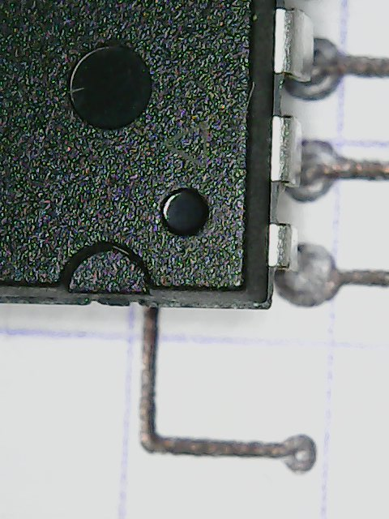
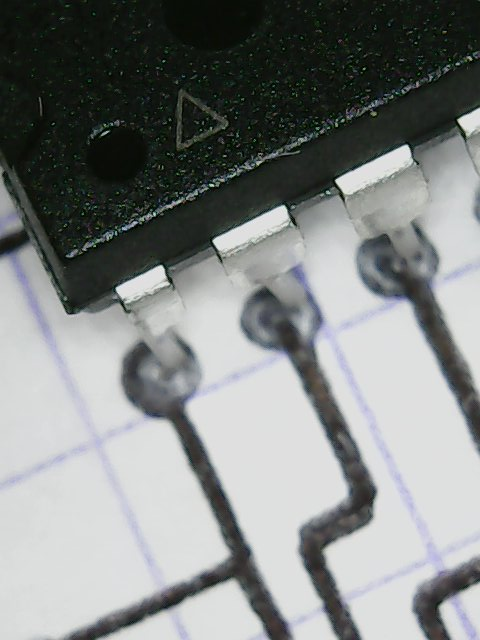
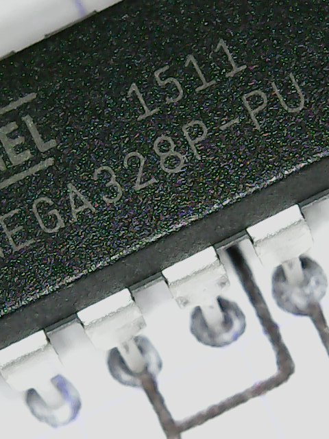

# 123DCircuitsDL
Quick &amp; dirty js bookmark that 'll download SVGs from 123D Circuits ( for when you want to use those in Illustrator instead of downloading the Gerber files &amp; firing' up Eagle .. ;p )

R: the good stuff is in cleanWip.js ;P

## update: bookmark the following in your toolbar to be able to just click on the bookmark to display the downloads pane
( see source of the README for actual link code .. )
<a id="bookmark" href="!function(){function e(e){window.toZip.push(e),console.log(&quot;viewTypes to be zipped: &quot;+window.toZip)}function t(e){for(var t=0;t&amp;lt;window.toZip.length;t++)if(window.toZip[t]===e){window.toZip.splice(t,1);break}console.log(&quot;viewTypes to be zipped: &quot;+window.toZip)}function i(e){for(var t=0;t&amp;lt;d.length;t++)if(d[t][0]+&quot;_&quot;+d[t][3]===e)return d[t]}function n(e){var t=i(e);if(&quot;csv&quot;===t[3]){var n=new Blob([t[2]],{type:&quot;text/plain;charset=utf-8&quot;});saveAs(n,t[0]+&quot;.&quot;+t[3])}else if(&quot;html&quot;===t[3]){var n=new Blob([t[2]],{type:&quot;text/html;charset=utf-8&quot;});saveAs(n,t[0]+&quot;.&quot;+t[3])}else if(&quot;svg&quot;===t[3]){var o='&amp;lt;?xml version=&quot;1.0&quot; standalone=&quot;no&quot;?&amp;gt;&amp;lt;!DOCTYPE svg PUBLIC &quot;-//W3C//DTD SVG 1.1//EN&quot; &quot;http://www.w3.org/Graphics/SVG/1.1/DTD/svg11.dtd&quot;&amp;gt;',l=(new XMLSerializer).serializeToString(t[2]),n=new Blob([o+l],{type:&quot;image/svg+xml;charset=utf-8&quot;});saveAs(n,t[0]+&quot;.&quot;+t[3])}}function o(){document.querySelector(&quot;#dlPopup&quot;).querySelectorAll('input[type=&quot;checkbox&quot;]');[].forEach(function(e){e.click()}),console.log(&quot;showiiing-yum ( not chewing gum ! )&quot;)}function l(e){o(),x.style.right=&quot;0px&quot;}var r=document.createElement(&quot;script&quot;);r.src=&quot;https://cdn.rawgit.com/eligrey/FileSaver.js/master/FileSaver.js&quot;,document.body.appendChild(r);var s=document.createElement(&quot;script&quot;);s.src=&quot;https://cdn.rawgit.com/Stuk/jszip/master/dist/jszip.min.js&quot;,document.body.appendChild(s);var a=document.querySelector(&quot;.js-circuit-menu-title&quot;).textContent||document.querySelector(&quot;.vertical-spacing--title&quot;).textContent.substr(0,document.querySelector(&quot;.vertical-spacing--title&quot;).textContent.indexOf(&quot;|&quot;)-3),c=document.querySelectorAll(&quot;div.sitemenu__right__item--editor&quot;),p=c[1].querySelectorAll(&quot;a&quot;),d=[];[].forEach.call(p,function(e){&quot;bom&quot;!==e.href.substr(e.href.indexOf(&quot;#&quot;)+1)&amp;amp;&amp;amp;d.push([e.href.substr(e.href.indexOf(&quot;#&quot;)+1),e.querySelector(&quot;svg&quot;),document.querySelector(e.href.substr(e.href.indexOf(&quot;#&quot;))+&quot;Tab&quot;).querySelector(&quot;svg&quot;),&quot;svg&quot;])});var u=document.querySelector('a[href=&quot;#bom&quot;]');u.click();var h=document.querySelector(&quot;table.bom__table&quot;),g=h.innerText.replace(/\s{8}/g,&quot;	&quot;).replace(/\s{3,}/g,&quot;\n&quot;).replace(/\t{1,}/g,&quot;,&quot;);g.replace(/,\n/g,',&quot;&quot;\n'),g.endsWith(&quot;,&quot;)&amp;amp;&amp;amp;(g+='&quot;&quot;\n'),d.push([u.href.substr(u.href.indexOf(&quot;#&quot;)+1),u.querySelector(&quot;svg&quot;),(new XMLSerializer).serializeToString(h),&quot;html&quot;],[u.href.substr(u.href.indexOf(&quot;#&quot;)+1),u.querySelector(&quot;svg&quot;),a+&quot; - Bill Of Materials\n&quot;+g,&quot;csv&quot;]);var m=document.createElement(&quot;ul&quot;);m.style.paddingLeft=&quot;0px&quot;,d.forEach(function(i){var o=document.createElement(&quot;li&quot;);o.className=&quot;circuit-view&quot;,o.setAttribute(&quot;data-viewType&quot;,i[0]),o.setAttribute(&quot;data-viewExt&quot;,i[3]),o.style.display=&quot;block&quot;,o.style.height=&quot;50px&quot;;var l=document.createElement(&quot;input&quot;);l.type=&quot;checkbox&quot;,l.id=i[0],l.style[&quot;float&quot;]=&quot;left&quot;,l.style.marginTop=&quot;2.5px&quot;,l.style.marginRight=&quot;10px&quot;,l.style.width=l.style.height=&quot;50px&quot;,l.style.marginTop=&quot;0px&quot;,l.style.opacity=&quot;0&quot;,l.style.cursor=&quot;pointer&quot;,l.onchange=function(){console.log(&quot;CHECKBOX CHANGE HAPPENED !&quot;),this.checked?(e(this.parentElement.getAttribute(&quot;data-viewType&quot;)+&quot;_&quot;+this.parentElement.getAttribute(&quot;data-viewExt&quot;)),this.nextSibling.innerHTML=&quot;&amp;amp;#10003;&quot;,this.nextSibling.style.color=&quot;#0696D7&quot;,this.nextSibling.nextSibling.style.color=&quot;#0696D7&quot;):(t(this.parentElement.getAttribute(&quot;data-viewType&quot;)+&quot;_&quot;+this.parentElement.getAttribute(&quot;data-viewExt&quot;)),this.nextSibling.innerHTML=&quot;&amp;amp;#9675;&quot;,this.nextSibling.style.color=&quot;#C5CFD9&quot;,this.nextSibling.nextSibling.style.color=&quot;#C5CFD9&quot;)};var r=document.createElement(&quot;div&quot;);r.style.pointerEvents=&quot;none&quot;,r.className=&quot;sitemenu__view_switch sitemenu__svg_block_btn&quot;,r.style[&quot;float&quot;]=&quot;left&quot;,r.style.marginLeft=&quot;-62px&quot;,r.innerHTML=&quot;&amp;amp;#9675;&quot;,r.style.color=&quot;rgb(197, 207, 217);&quot;,r.style.fontSize=&quot;30px&quot;,r.style.textAlign=&quot;center&quot;,r.style.lineHeight=&quot;50px&quot;,r.onmouseenter=function(){this.setAttribute(&quot;data-glyph&quot;,this.innerHTML),this.innerHTML=&quot;&amp;amp;#10003;&quot;,console.log(&quot;iconDiv mouse enter happened !&quot;)},r.onmouseleave=function(){this.innerHTML=this.getAttribute(&quot;data-glyph&quot;),console.log(&quot;iconDiv mouse leave happened !&quot;)};var s=document.createElement(&quot;a&quot;);s.textContent=i[0],&quot;bom&quot;===i[0]?s.textContent=i[0]+&quot; (.&quot;+i[3]+&quot;)&quot;:s.textContent=i[0],s.style.display=&quot;block&quot;,s.style.lineHeight=&quot;50px&quot;,s.style.fontSize=&quot;20px&quot;,s.onclick=function(){console.log(this.parentElement.getAttribute(&quot;data-viewType&quot;)+&quot; to be savedAs !&quot;),n(this.parentElement.getAttribute(&quot;data-viewType&quot;)+&quot;_&quot;+this.parentElement.getAttribute(&quot;data-viewExt&quot;))},s.onmouseover=function(){this.setAttribute(&quot;data-color&quot;,this.style.color),this.style.color=&quot;#0696D7&quot;,console.log(&quot;dlLink mouse over happened !&quot;)},s.onmouseout=function(){this.style.color=this.getAttribute(&quot;data-color&quot;),console.log(&quot;dlLink mouse out happened !&quot;)},o.appendChild(l),o.appendChild(r),o.appendChild(s),m.appendChild(o)});var y=document.createElement(&quot;h4&quot;);y.textContent=&quot;Export options&quot;,y.style.fontFamily='&quot;Roboto&quot;,sans-serif',y.style.fontWeight=&quot;500&quot;,y.style.paddingTop=&quot;18px&quot;,y.style.textAlign=&quot;center&quot;;var v=document.createElement(&quot;a&quot;);v.textContent=a.replace(/ /g,&quot;_&quot;)+&quot;.zip&quot;,v.style.textOverflow=&quot;ellipsis&quot;;var f=document.createElement(&quot;p&quot;);f.innerHTML=&quot;click to download,&amp;lt;br&amp;gt; tick to add to .zip&quot;,f.style.textAlign=&quot;center&quot;,f.style.fontSize=&quot;15px&quot;;var x=document.createElement(&quot;div&quot;);x.id=&quot;dlPopup&quot;,x.appendChild(y),x.appendChild(f),x.appendChild(m),x.appendChild(v),x.style.zIndex=1e3,x.style.position=&quot;absolute&quot;,x.style.backgroundColor=&quot;white&quot;,x.style.right=&quot;0px&quot;,x.style.top=&quot;48px&quot;,x.style.borderTop=&quot;1px solid #C5CFD9&quot;,x.style.width=&quot;192px&quot;,x.style.paddingTop=&quot;5.5px&quot;,x.style.paddingLeft=&quot;5.5px&quot;,x.style.paddingBottom=&quot;5.5px&quot;,x.style.right=&quot;-200px&quot;,x.style.webkitTransition=&quot;right 500ms ease-out&quot;,document.body.appendChild(x),window.toZip=[],v.onclick=function(){console.log(&quot;get the items names from toZip array &amp;amp; zim 'em all ! &quot;);for(var e=new JSZip,t=0;t&amp;lt;window.toZip.length;t++){var n=i(window.toZip[t]);if(&quot;csv&quot;===n[3])e.file(n[0]+&quot;.&quot;+n[3],n[2]+&quot;\n&quot;);else if(&quot;html&quot;===n[3])e.file(n[0]+&quot;.&quot;+n[3],n[2]);else if(&quot;svg&quot;===n[3]){var o='&amp;lt;?xml version=&quot;1.0&quot; standalone=&quot;no&quot;?&amp;gt;&amp;lt;!DOCTYPE svg PUBLIC &quot;-//W3C//DTD SVG 1.1//EN&quot; &quot;http://www.w3.org/Graphics/SVG/1.1/DTD/svg11.dtd&quot;&amp;gt;',l=(new XMLSerializer).serializeToString(n[2]);e.file(n[0]+&quot;.&quot;+n[3],o+l)}}var r=e.generate({type:&quot;blob&quot;});saveAs(r,a.replace(/ /g,&quot;_&quot;)+&quot;.zip&quot;)},setTimeout(function(){l()},500)}();"> bookmark</a>

